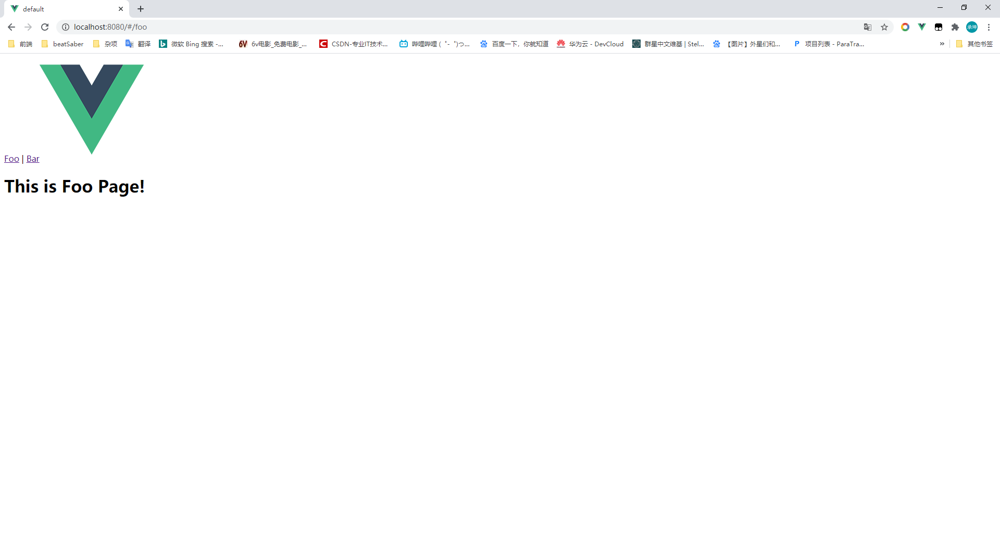

# VUE ROUTER 的使用

## 1. Vue-Router的基本使用

### 1. 安装

CDN方法直接在HTML中直接引用。

```html
<script src="/path/to/vue.js"></script>
<script src="/path/to/vue-router.js"></script>
```

NPM安装。

```
npm install vue-router
```

在模块化工程中使用的情况下需要显示调用路由组件。

```javascript
import Vue from 'vue'
import VueRouter from 'vue-router'

Vue.use(VueRouter)
```

### 2.路由配置

要使用路由需要先对路由的**Path**与**component**组件进行一个映射，之后才能在对应的路由出口中渲染出来。

```javascript
import Vue from 'vue';
import router from 'vue-router';
// 导入组件
import Foo from './components/Foo.vue';
import Bar from './components/Bar.vue';

//模块化工程需显示调用use方法安装.
Vue.use(router);

//配置路由
const routes = [
  {
    path: '/foo', //这个路由映射的路径
    component: Foo, //这个路由映射的对应组件,路由渲染就是渲染这个组件
  },
  { path: '/bar', component: Bar },
];

//导出路由实例
export default new router({
  routes, //ES6语法的简写，相当于ES5的routes:routes,
});
```

```javascript
//Main.js
import Vue from 'vue';
import App from './App.vue';
import router from './router'; //导入路由实例

new Vue({
  router, //注入路由，即可在应用中使用
  render: (h) => h(App),
}).$mount('#app');

```

### 3.路由的基本使用

路由需要一个路由出口才能显示出来，因此，你需要在你的App模板上加入`<router-view>`标签已标识这是路由视图的出口。

```html
<template>
	<div id="app">
        
        <!-- 路由出口，对应的组件渲染在这里！ -->
        <router-view></router-view>
	</div>
</template>
```

而具体的路由导航则需要`<router-link>`标签的`to属性`来指向你要去的路径，注:`<router-link>`标签默认会被渲染为一个`a`标签，可以通过`tag`属性更改，这里先不谈。

```vue
<!--App.vue-->
<template>
	<div id="app">
		<!-- router-link标签用来指向你要去的路由路径 -->
		<router-link to="/foo">Foo</router-link> |
		<router-link to="/bar">Bar</router-link>
		
		<!-- 路由出口，对应的组件渲染在这里！ -->
		<router-view></router-view>
	</div>
</template>

<script>

export default {
	name: 'app',
}
</script>
<style>
</style>
```

实际效果：



路由切换：


## 2.基础

### 通过代码跳转路由

除了通过<router-link>标签跳转路由以外，Vue-router还提供了通过代码跳转路由的API，主要使用有`router.push`，`router.replace`，`router.go`方法。

HTML5 `History` API参考：https://developer.mozilla.org/zh-CN/docs/Web/API/History_API

```javascript
//push方法,可以传入一个字符串，也可以传入对象。
// 字符串
router.push('home')
// 对象
router.push({ path: 'home' })
//调用push方法时，它会像history栈压入一个新的记录，所以，当用户点击浏览器后退按钮时，会回到之前的 URL。
//与window.history.push方法类似.
```

```javascript
//replace方法
//与push方法类似，不同的是它不会向history栈压入一个新记录，而是直接替换掉当前history记录。所以，浏览器会话记录不会新增任何记录。
//字符串
router.replace('home');
//同样可以传入对象
router.replace({ path: 'home' });
```

```javascript
//go方法

//与window.history API类似，可以操作会话历史的前进与后退等...
router.go(1); //参数为具体前进或后退的步数
router.go(-1);
```

### 路由重定向

可以为某些特定的路由配置重定向，一般用于捕获未知路由。比如，使用通配符将用户访问到的错误页面重定向到`error`页面。（**注意**：使用`通配符(*)`时要确保路由的顺序是正确的，也就是说含有`通配符(*)`的路由应该放在最后。)

```javascript
const page404 = {
  template: '<div><h1>404 ERROR</h1></div>',
};

const router = new VueRouter({
  routes: [{ path: '/error', component: page404 },{ path: '*', redirect: '/error' }],
});
```

### 嵌套路由

来自官网的解释：实际生活中的应用界面，通常由多层嵌套的组件组合而成。同样地，URL 中各段动态路径也按某种结构对应嵌套的各层组件。

嵌套路由的使用：

```javascript
import Vue from 'vue';
import router from 'vue-router';
// 导入组件
import MAIN from './components/Main.vue';
import ABOUT from './components/About.vue';
import main1 from './subPages/MainSub.vue';
import main2 from './subPages/MainSub2.vue';

//模块化工程需显示调用use方法安装.
Vue.use(router);

//配置路由
const routes = [
  {
    path: '/main', //这个路由映射的路径
    component: MAIN, //这个路由映射的对应组件,路由渲染就是渲染这个组件
    children: [{ path: 'sub1', component: main1 }, { path: 'sub2', component: main2 }], //子组件映射,其实里面与正常路由配置一样的，因此可以无限嵌套子组件(无限套娃)
    //注意：以 / 开头的嵌套路径会被当作根路径。 这让你充分的使用嵌套组件而无须设置嵌套的路径。
  },
  { path: '/about', component: ABOUT },
];

//导出路由实例
export default new router({
  routes, //ES6语法的简写，相当于ES5的routes:routes,
});
```

```html
<!--main组件需要一个router-view标签来为子路由提供出口-->
<template>
	<div>
		<h1>我是main页面！！</h1>
        <!--有个小细节，这里的路径需要写上完整路径,不然无法匹配到子组件，最好使用命名路由(方便)-->
		<router-link to="/main/sub1">sub1</router-link> | 
		<router-link to="/main/sub2">sub2</router-link>
		<router-view></router-view>
	</div>
</template>
```

### 路由命名

有时候，通过一个名称来标识一个路由显得更方便一些，特别是在链接一个路由，或者是执行一些跳转的时候。你可以在创建 Router 实例的时候，在 `routes` 配置中给某个路由设置名称。

```javascript
//修改上述例子
import Vue from 'vue';
import router from 'vue-router';
// 导入组件
import MAIN from './components/Main.vue';
import ABOUT from './components/About.vue';
import main1 from './subPages/MainSub.vue';
import main2 from './subPages/MainSub2.vue';

//模块化工程需显示调用use方法安装.
Vue.use(router);

//配置路由
const routes = [
  {
    path: '/main', //这个路由映射的路径
    component: MAIN, //这个路由映射的对应组件,路由渲染就是渲染这个组件
    children: [
       //命名路由很简单,只需要在参数加入name属性即可
      { path: 'sub1', name: 'sub1', component: main1 },
      { path: 'sub2', name: 'sub2', component: main2 },
    ], //子组件映射,其实里面与正常路由配置一样的，因此可以无限嵌套子组件(无限套娃)
    //注意：以 / 开头的嵌套路径会被当作根路径。 这让你充分的使用嵌套组件而无须设置嵌套的路径。
  },
  { path: '/about', component: ABOUT },
];

//导出路由实例
export default new router({
  routes, //ES6语法的简写，相当于ES5的routes:routes,
});
```

```html
<!--模板-->
<template>
	<div>
		<h1>我是main页面！！</h1>
		<router-link :to="{name:'sub1'}">sub1</router-link> |
		<router-link :to="{name:'sub2'}">sub2</router-link>
		<router-view></router-view>
	</div>
</template>
```

```javascript
//同理，代码跳转也是一样的
router.push({ name: 'sub1'})
```

### 视图命名

有时候想同时 (同级) 展示多个视图，而不是嵌套展示，例如创建一个布局，有 `sidebar` (侧导航) 和 `main` (主内容) 两个视图，这个时候命名视图就派上用场了。你可以在界面中拥有多个单独命名的视图，而不是只有一个单独的出口。如果 `router-view` 没有设置名字，那么默认为 `default`。

```javascript
//一个视图使用一个组件渲染，因此对于同个路由，多个视图就需要多个组件。确保正确使用 components 配置 (带上 s)
const router = new VueRouter({
  routes: [
    {
      path: '/',
      components: {
        default: Foo, //视图没有名字时默认default
        a: Bar, 
        b: Baz
      }
    }
  ]
})
```

```html
<router-view></router-view>
<router-view name="a"></router-view>
<router-view name="b"></router-view>
```

### 路由传参

想在路由之间传递参数可以在路由可以通过几种不同设置实现

1.Param的形式

```javascript
//配置文件中在path属性后面跟上:xxx，xxx为你想要的参数名称,
{ path: '/param/:user', component: () => import('./components/ParamTest.vue') },
```

```html
<!--在对应的模板中-->
<template>
	<div>
		<ul>
            <!--通过$route获取参数-->
			<li>用户：{{$route.params.user}}</li>
         </ul>
    </div>
</template>
```

传递后形成的路径为 `/param/admin` `/param/123456` 之类的

2.query的形式

```javascript
//配置
{ path: '/query', component: () => import('./components/QueryTest.vue') }, //query方式
```

```html
<!-- query方式传递的为一个对象 -->
<router-link :to="{path:'/query',query:{name:'Ankol',sex:'男',age:18}}">query</router-link>
```

```html
<template>
	<div>
		<h1>我是Query方法测试哦！</h1>
		<ul>
			<li>name:{{$route.query.name}}</li>
			<li>age:{{$route.query.age}}</li>
			<li>sex:{{$route.query.sex}}</li>
		</ul>
	</div>
</template>
```

以props的方式传递

为什么使用`Props`：(官方解释) 在组件中使用 `$route` 会使之与其对应路由形成高度耦合，从而使组件只能在某些特定的 URL 上使用，限制了其灵活性。使用 `props` 将组件和路由解耦.

param传递至prop

```javascript
{ path: '/props/:name', component: () => import('./components/PropsTest.vue'), props: true }, 
// 通过 route.params 传递至props
```

静态props

```javascript
  { path: '/props', component: () => import('./components/PropsTest.vue'), props: {name:'Ankol'} }, //静态props,适用于参数不会发生变化的情形
```

函数props

```javascript
{ path: '/props', component: SearchUser, props: (route) => ({ name: route.query.q }) }
//函数props，通过传递一个回调函数，将route.query参数与props做一个映射
```

组件需具有props选项

```html
<template>
	<div>
		<h1>我是Props参数传递测试!</h1>
		<fieldset>
			<legend>参数框</legend>
			<ul>
				<li>Name:{{name}}</li>
			</ul>
		</fieldset>
	</div>
</template>
<script>
export default {
	props: ['name']
}
</script>
```

## 3.进阶

### 路由懒加载

如果一直像我们之前那样以传统方式一次性导入全部模板的话，随着模板的增多，用户一次性请求的JS文件数逐渐增大，可能会造成网络延迟的情况，这时可以考虑进行按需加载，即用户使用时才去加载对应的模板文件。

```javascript
//需使用动态import语法
//配置路由
const routes = [
  {
    path: '/main', 
    //import方法将路由加载的方式改为懒加载(用时才去请求)
    component: () => import('./components/Main.vue'), //这个路由映射的对应组件,路由渲染就是渲染这个组件
    children: [
      { path: 'sub1', name: 'sub1', component: () => import('./subPages/MainSub.vue') },
      { path: 'sub2', name: 'sub2', component: () => import('./subPages/MainSub2.vue') },
    ],
  },
  { path: '/about', component: () => import('./components/About.vue') },
];
```

如图，所有组件引入被修改为使用import方法进行导入，这时，只有用户在加载对应的路由时才会去进行组件请求。

### 导航守卫

官方解释： **“导航”**表示路由正在发生改变。

正如其名，`vue-router` 提供的导航守卫主要用来通过跳转或取消的方式守卫导航。有多种机会植入路由导航过程中：全局的, 单个路由独享的, 或者组件级的。

#### 全局前置守卫

可以通过`router.beforEach`来注册一个全局导航守卫，此函数在每个导航发生时都会被调用。

```javascript
router.beforeEach((to, from, next) => {
  // ...
})
```

**`to: Route`**: 即将要进入的目标 [路由对象](https://router.vuejs.org/zh/api/#路由对象)

**`from: Route`**: 当前导航正要离开的路由

**`next: Function`**: 一定要调用该方法来 **resolve** 这个钩子。执行效果依赖 `next` 方法的调用参数。

- **`next()`**: 进行管道中的下一个钩子。如果全部钩子执行完了，则导航的状态就是 **confirmed** (确认的)。

- **`next(false)`**: 中断当前的导航。如果浏览器的 URL 改变了 (可能是用户手动或者浏览器后退按钮)，那么 URL 地址会重置到 `from` 路由对应的地址。

- **`next('/')` 或者 `next({ path: '/' })`**: 跳转到一个不同的地址。当前的导航被中断，然后进行一个新的导航。你可以向 `next` 传递任意位置对象，且允许设置诸如 `replace: true`、`name: 'home'` 之类的选项以及任何用在 [`router-link` 的 `to` prop](https://router.vuejs.org/zh/api/#to) 或 [`router.push`](https://router.vuejs.org/zh/api/#router-push) 中的选项。

- **`next(error)`**: (2.4.0+) 如果传入 `next` 的参数是一个 `Error` 实例，则导航会被终止且该错误会被传递给 [`router.onError()`](https://router.vuejs.org/zh/api/#router-onerror) 注册过的回调。

  确保 `next` 函数在任何给定的导航守卫中都被严格**调用一次**。它可以出现多于一次，但是只能在所有的逻辑路径都不重叠的情况下，否则钩子永远都不会被解析或报错。

#### 全局解析守卫

2.5.0 新增

使用`router.beforeResolve`注册，参数与`beforEach`一致，不同之处在于导航被确认之前，**同时在所有组件内守卫和异步路由组件被解析之后**，解析守卫就被调用。

```javascript
router.beforeResolve((to, from, next) => {
  //...
});
```

#### 全局后置钩子

使用`router.afterEach`注册全局后置钩子，和守卫不同的是，这些钩子不会接受 `next` 函数也不会改变导航本身：

```javascript
router.afterEach((to, from) => {
  // ...
})
```

#### 路由独享的守卫

`beforeEnter`此守卫在路由上面单独配置，进入路由时被调用...

```javascript
{
      path: '/query',
      component: () => import('./components/QueryTest.vue'),
      beforeEach: (to, from, next) => alert('进入query页面!'), //进入此路由时被调用
}, 
```

#### 组件内的守卫

你可以在路由组件内直接定义以下路由导航守卫：

- `beforeRouteEnter`

- `beforeRouteUpdate` (2.2 新增)

- `beforeRouteLeave`

  ```javascript
  const Foo = {
    template: `...`,
    beforeRouteEnter (to, from, next) {
      // 在渲染该组件的对应路由被 confirm 前调用
      // 不！能！获取组件实例 `this`
      // 因为当守卫执行前，组件实例还没被创建
    },
    beforeRouteUpdate (to, from, next) {
      // 在当前路由改变，但是该组件被复用时调用
      // 举例来说，对于一个带有动态参数的路径 /foo/:id，在 /foo/1 和 /foo/2 之间跳转的时候，
      // 由于会渲染同样的 Foo 组件，因此组件实例会被复用。而这个钩子就会在这个情况下被调用。
      // 可以访问组件实例 `this`
    },
    beforeRouteLeave (to, from, next) {
      // 导航离开该组件的对应路由时调用
      // 可以访问组件实例 `this`
    }
  }
  ```

`beforeRouteEnter`虽然不能直接访问`this`实例，但可以通过传入一个next回调来访问组件实例，此回调在导航被确认的时候执行，并且把组件实例作为回调方法的参数。

```javascript
beforeRouteEnter (to, from, next) {
  next(vm => {
    // 通过 `vm` 访问组件实例
  })
}
```

另外,`beforeRouteEnter`是唯一可以传入`next`回调的方法，对于`beforeRouteUpdate` `beforeRouteLeave`来说，**this**本就是可用的。

### 完整的调用流程(来自官网)

1. 导航被触发。
2. 在失活的组件里调用 `beforeRouteLeave` 守卫。
3. 调用全局的 `beforeEach` 守卫。
4. 在重用的组件里调用 `beforeRouteUpdate` 守卫 (2.2+)。
5. 在路由配置里调用 `beforeEnter`。
6. 解析异步路由组件。
7. 在被激活的组件里调用 `beforeRouteEnter`。
8. 调用全局的 `beforeResolve` 守卫 (2.5+)。
9. 导航被确认。
10. 调用全局的 `afterEach` 钩子。
11. 触发 DOM 更新。
12. 用创建好的实例调用 `beforeRouteEnter` 守卫中传给 `next` 的回调函数。

## 4.细节以及常用API参考

查看官网：https://router.vuejs.org/zh/api/

